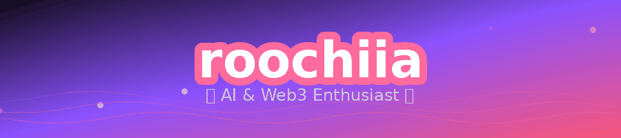

 

**Long-life learner** from Indonesia 🇮🇩, building a small family of AI agents
and the memory systems that keep them coherent.

 

## The agents

Three agents, one shared memory layer. Each one has a job it actually does.

| | agent | what it does |
|:--:|:--|:--|
| 🌸 | **Mayuri** | general-purpose assistant, and the one I talk to most |
| 🍵 | **Meica** | family-facing assistant — softer edges, same brain |
| 🎴 | **Jiho** | NFT minting operations, runs the parts that must not be improvised |

> All three run on **Hermes**, with persistent memory through **GBrain** —
> because an agent that forgets yesterday isn't an assistant, it's a search box.

 

## What I'm into

<table>
<tr>
<td width="50%" valign="top">

**Multi-agent architecture**
How several agents share context without stepping on each other.

**Second brain systems**
Obsidian, GBrain, and the unglamorous plumbing that makes memory persist.

</td>
<td width="50%" valign="top">

**Web3 &amp; automation**
Minting bots and the kind of scripts that run while I sleep.

**Currently building**
[GBrain Second Brain Setup](https://github.com/belaroochiia/gbrain-second-brain) —
a guide to giving AI agents memory that survives a restart.

</td>
</tr>
</table>

 

## Daily drivers

 

## Contribution snake

<picture>
  <source media="(prefers-color-scheme: dark)" srcset="https://raw.githubusercontent.com/belaroochiia/belaroochiia/output/github-snake-dark.svg" />
  <source media="(prefers-color-scheme: light)" srcset="https://raw.githubusercontent.com/belaroochiia/belaroochiia/output/github-snake.svg" />
  
</picture>

 

☕ built with coffee and curiosity · <b>roochiia</b>

